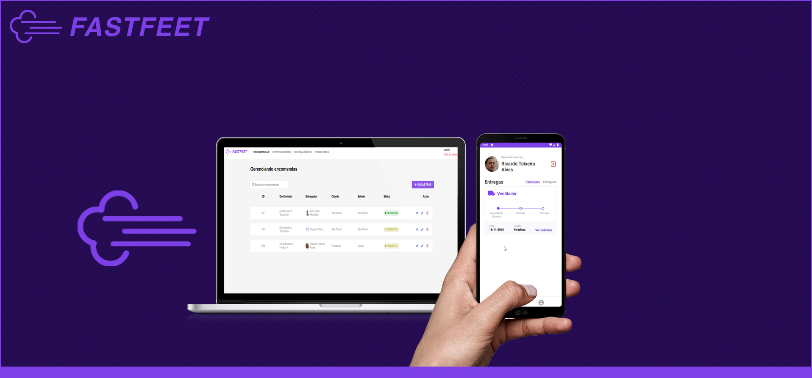
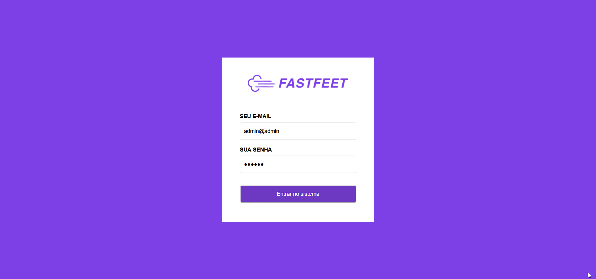
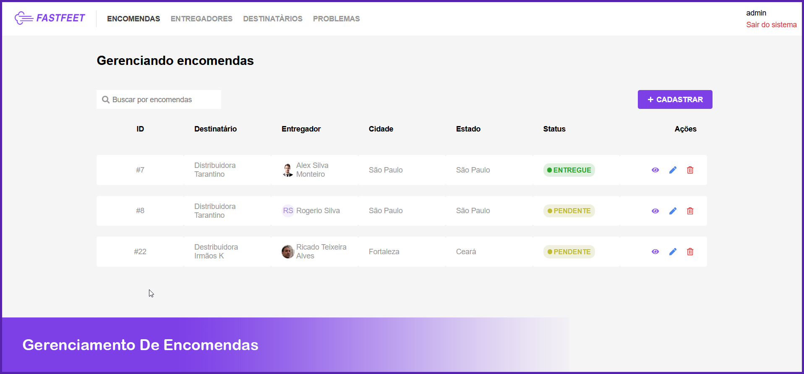
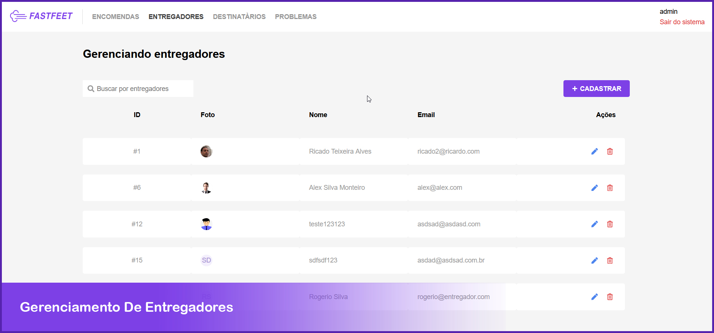
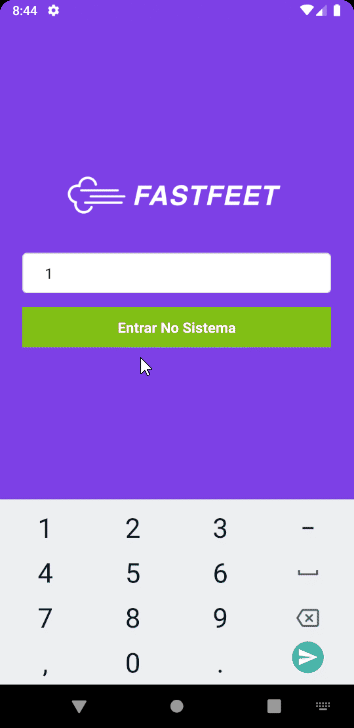
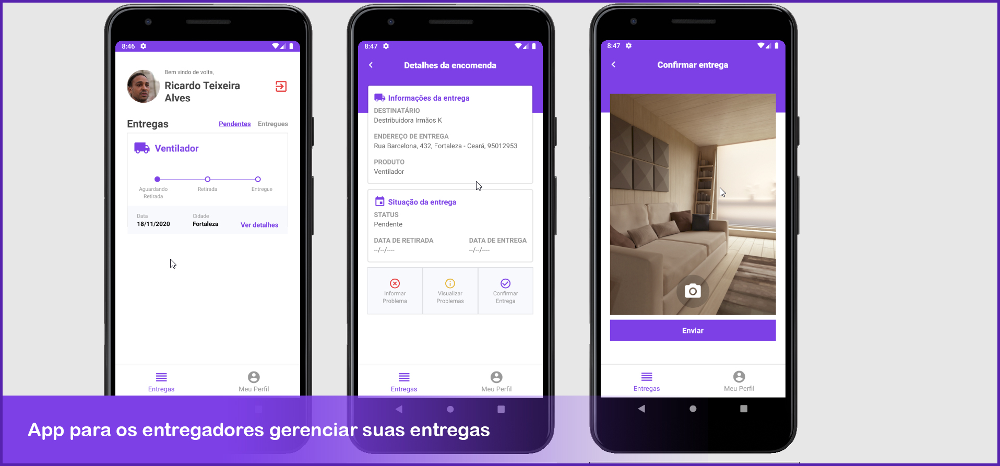

<p align="center">
  
</p>

# FastFeet
  
   

<p align="center">
  
</p>

## Tecnologias
```
- [x] NodeJS
- [x] Express
- [x] Sequelize
- [x] JWT
- [x] PostGress
```
```
- [x] ReactJS
- [x] Axios
- [x] Redux
- [x] React Router Dom
```
```
- [x] React Native
- [x] React Native Camera
- [x] React Navigation
```

## Sobre o Projeto
Aplicação completa (Back-end, Front-end e Mobile) de uma transportadora fictícia, com base no desafio em quatro etapas: 
```
- https://github.com/rocketseat-education/bootcamp-gostack-desafio-02
- https://github.com/rocketseat-education/bootcamp-gostack-desafio-03
- https://github.com/rocketseat-education/bootcamp-gostack-desafio-09
- https://github.com/rocketseat-education/bootcamp-gostack-desafio-10
```

### Web
<p align="center">
  
</p>
<p>A parte web tem o propósito de gerenciar a transpostadora e todos os seus módulos (entregadores, entregas,destinos e problemas).</p>
<p align="center">
  
</p>
<p align="center">
  
</p>

### APP
<p align="center">
  
</p>
<p>A parte mobile serve para o entregador gerenciar suas encomendas, relatar problemas e confirmar a entrega tirando uma foto da assinatura do destinatário.</p>
<p align="center">
  
</p>

## Instalação
### Back-end 
```
cd fastfeet-backend
npm install
configurar o arquivo .envExample seguindo os passos, depois renomeie para ".env"
npx sequelize-cli db:migrate
npm run dev
```

### Fron-end (Web)
```
cd fastfeet-web
npm install
npm run start
```

### Fron-end (Mobile) `Requer o Android Studio + Emulador Android`
```
Abra o Emulador no Android Studio
cd fastfeetMobile
npx react-native run-android
